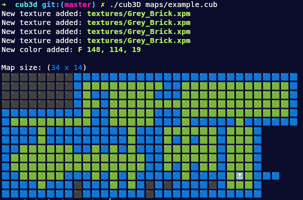
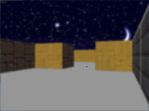

# Cub3D

This project is inspired by the world-famous eponymous 90's game, which was the first FPS ever. It explore ray-casting and 3D graphics. In essence, Cub3D challenges participants to create a 3D maze visualization system, emphasizing graphics rendering, interactive controls, and efficient algorithmic design while adhering to specific file format and functionality requirements.

## Tehnologies

## Requirements

- The management of your window must remain smooth: changing to another window, minimizing, etc.
- Display different wall textures that vary depending on which side the wall is facing (North, South, East, West).
- Program must be able to set the floor and ceiling colors to two different ones.
- The left and right arrow keys of the keyboard must allow you to look left and
right in the maze.
- The W, A, S, and D keys must allow you to move the point of view through
the maze.
- Pressing ESC must close the window and quit the program cleanly.
- Clicking on the red cross on the window’s frame must close the window and
quit the program cleanly.
- Program must take as a first argument a scene description file with the .cub
extension.
	- The map must be composed of only 6 possible characters: 0 for an empty space,
	1 for a wall, and N,S,E or W for the player’s start position and spawning
	orientation
	- The map must be closed/surrounded by walls, if not the program must return an error.
	- Except for the map content, each type of element can be separated by one or
	more empty line(s).
	- Except for the map content which always has to be the last, each type of
	element can be set in any order in the file.
	-  Except for the map, each type of information from an element can be separated
	by one or more space(s).
	- The map must be parsed as it looks in the file. Spaces are a valid part of the
	map.
	- Parse any kind of map,
	as long as it respects the rules of the map.
## Screenshots

